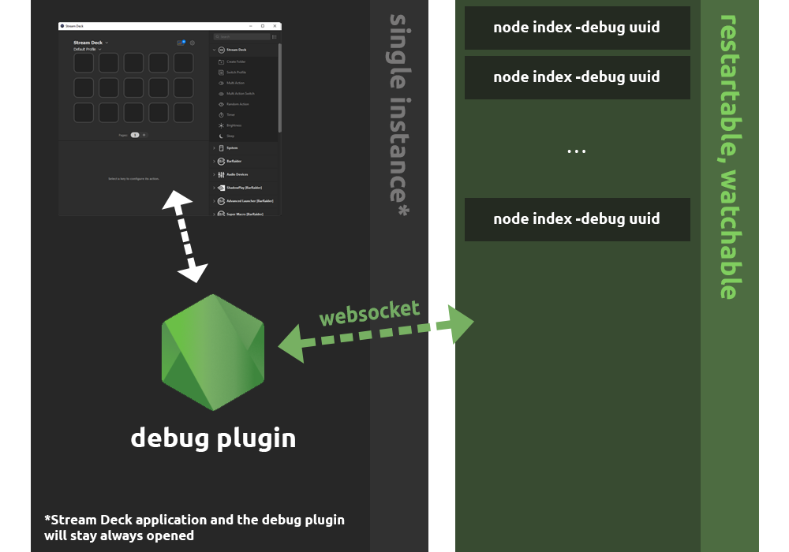

# Development Plugin

for Elgato Stream Deck plugin development (using [Node.js sdk](sdk-github-page))

## Description

Simply proxy the Application's events to node's script using a **WebSocket Server**



## Release

You can download a prebuilt debug-plugin for:

- [Windows](https://github.com/Stream-Deck-for-Node-js/development-plugin/releases/download/1.0.0/debug-plugin-win.exe)
- [MacOS](https://github.com/Stream-Deck-for-Node-js/development-plugin/releases/download/1.0.0/debug-plugin-macos)

## Build

You can build your local debug-plugin binary using:

```shell
npm build
```

## Author

Francesco Saverio Cannizzaro ([fcannizzaro](https://github.com/fcannizzaro))

## License

MIT
